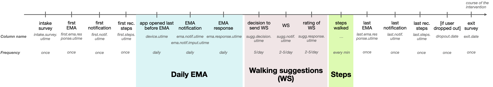
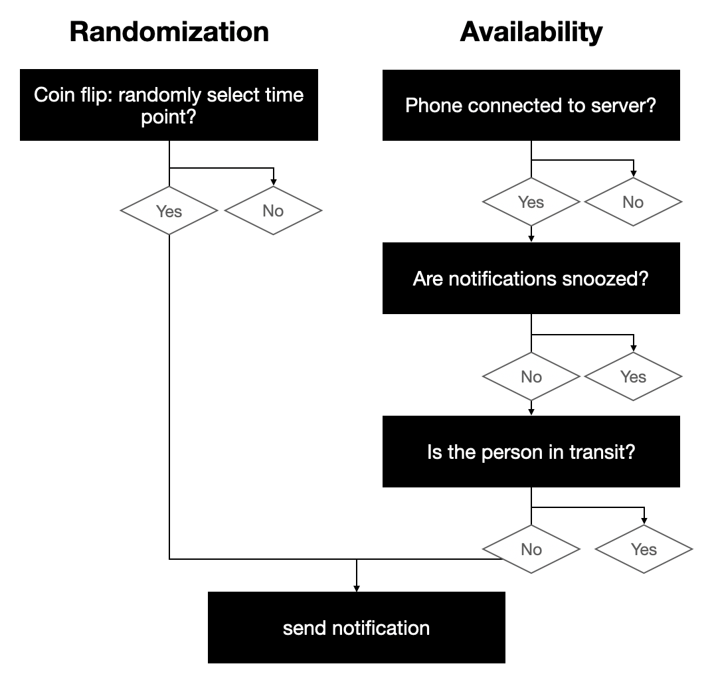

# The HeartSteps Data

## Sources
**Creators**: Shawna Smith, Susan Murphy, Pedrag Klasnja, Nick Seewald  
**Latest version by**: Lisa Gotzian

from a mobile health intervention with the HeartSteps app

based on "analysis.RData" retrieved from Mbox (link not shared to the public)

initial documentation of "analysis.RData":
https://github.com/StatisticalReinforcementLearningLab/HeartstepsV1Code/wiki/C-Analysis-data-frames

documentation of the data cleaning process:
https://github.com/StatisticalReinforcementLearningLab/HeartstepsV1Code

## Past usage
* **Reinforcement Learning & Contextual Bandits**  
  Liao, P., Greenewald, K., Klasnja, P., & Murphy, S. (2020). Personalized HeartSteps: A Reinforcement Learning Algorithm for Optimizing Physical Activity. Proceedings of the ACM on Interactive, Mobile, Wearable and Ubiquitous Technologies, 4(1), 1–22. https://doi.org/10.1145/3381007

  Greenewald K, Tewari A, Klasnja P, Murphy S. Action Centered Contextual Bandits. Advances in Neural Information Processing Systems. 2017 Dec;30:5973-5981.

* **Development of MRTs**  
  Klasnja, P., Smith, S., Seewald, N. J., Lee, A., Hall, K., Luers, B., Hekler, E. B., & Murphy, S. A. (2019). Efficacy of Contextually Tailored Suggestions for Physical Activity: A Micro-randomized Optimization Trial of HeartSteps. Annals of Behavioral Medicine, 53(6), 573–582. https://doi.org/10.1093/abm/kay067

* **mHealth Data Collection Considerations**  
  Seewald, N.J., Smith, S.N., Lee, A.J. et al. Practical Considerations for Data Collection and Management in Mobile Health Micro-randomized Trials. Stat Biosci 11, 355–370 (2019). https://doi.org/10.1007/s12561-018-09228-w

* **Development of MRTs and sample size calculator**  
  Liao, P., Klasnja, P., Tewari, A., and Murphy, S. A. (2016) Sample size calculations for micro‐randomized trials in mHealth. Statist. Med., 35: 1944– 1971. doi: 10.1002sim.6847.


## About the dataset
(a) HeartSteps is an mHealth intervention that encourages regular walking via activity suggestions tailored to the individuals’ current context.  
(b) 6-week MRT with 37 participants, notifications sent 2-5 times/day  
(c) includes the following dataframes:
* [`users.csv`](https://github.com/LisaGotzian/HeartSteps/wiki/1.-users.csv), a 37x120 dataframe for each user,  
  **identifier**: *user.index*
* [`dailyema.csv`](https://github.com/LisaGotzian/HeartSteps/wiki/2.-dailyema.csv), a 1686x87 dataframe for each user for each day,  
  **identifier**: *user.index* and *ema.index*
* [`suggestions.csv`](https://github.com/LisaGotzian/HeartSteps/wiki/3.-suggestions.csv), a 8274x87 dataframe for each user for each notification,  
  **identifier**: *user.index*, *ema.index* and *decision.index*
* [`jbsteps.csv` and `gfsteps.csv`](https://github.com/LisaGotzian/HeartSteps/wiki/4.-steps.csv), a 197524x8 dataframe for steps from the google fitbit tracker and a 237865x11 dataframe for steps from the  jawbone tracker dataframe for each user for each minute,  
  **identifier**: *user.index*, *ema.index*, *decision.index* and *steps.utime*


## The tables
There is different events that are recorded within the data:


### [Users](https://github.com/LisaGotzian/HeartSteps/wiki/1.-users.csv)
[`users.csv`](https://github.com/LisaGotzian/HeartSteps/wiki/1.-users.csv) is a 37x120 data frame that contains demographic information on the participants as well as the results of the intake and exit surveys. Participants were interviewed before the study and after completing it. The exit survey re-administers the activity choice index, self-efficacy for physical activity and the IPAQ. The surveys collected data on the following topics:
* Demographic data
* Mobile phone use
* Walking environment at work
* Conscientiousness
* Activity Choice Index (intake and exit)
* Self-Efficacy for Physical Activity (intake and exit)
* International Prevalence Study (IPS) on Physical Activity
* International Physical Activity Questionnaire (IPAQ)(intake and exit)
* **identifier**: *user.index*


### [Daily EMA](https://github.com/LisaGotzian/HeartSteps/wiki/2.-dailyema.csv)
Every night, participants responded to an ecological momentary assessment (EMA) about their day. Their responses to the questions are recorded in [`dailyema.csv`](https://github.com/LisaGotzian/HeartSteps/wiki/2.-dailyema.csv), a 1686x87 data frame. The EMA includes the following data:
* notification time and response time
* the **context** the user was in during the notification
  * weather data
  * location data
  * front end application
  * recognized activity (still, active etc.)
* **daily EMA questions**
  * specific plan to walking by the user
  * how hectic, stressful and typical the day was
  * type of physical activity the user engaged in that day
* reasons for voting the suggestions in [`suggestions.csv`](https://github.com/LisaGotzian/HeartSteps/wiki/3.-suggestions.csv) up or down
* **enablers** and **barriers** for walking that day
* **identifier**: *user.index* and *ema.index*

### [Suggestions](https://github.com/LisaGotzian/HeartSteps/wiki/3.-suggestions.csv)
At two to five points during the day, a notification is sent, randomly selected and if the person was available. The walking suggestions and the responses are recorded in [`suggestions.csv`](https://github.com/LisaGotzian/HeartSteps/wiki/3.-suggestions.csv), a 8274x87 data frame.  


This table includes the following data:
* notification time and response time as well as the type of walking suggestion: "active" if a person has been active or "sedentary" if a person has been sedentary 
* the **context** the user was in during the notification & when voting the suggestion up or down
  * weather data
  * location data
  * front end application
  * recognized activity (still, active etc.)
* aggregated step counts before and after the suggestions
* **identifier**: *user.index*, *ema.index* and *decision.index*

### [Steps](https://github.com/LisaGotzian/HeartSteps/wiki/4.-steps.csv)
Using the jawbone tracker as well as the Google fit, a participant's steps were recorded throughout the intervention. The minute-by-minute steps are recorded in [`jbsteps.csv` and `gfsteps.csv`](https://github.com/LisaGotzian/HeartSteps/wiki/4.-steps.csv), a 197524x8 dataframe for steps from the google fitbit tracker and a 237865x11 dataframe for steps from the  jawbone tracker dataframe for each user for each minute.

**identifier**: *user.index*, *ema.index*, *decision.index* and *steps.utime*

## Data Issues

# Usage
## Preliminaries for working with time in R

```
## largest number of digits used to represent fractional seconds
options(digits.secs = 6)

## number of digits in Unix time (seconds since 1970-01-01 00:00 UTC)
## + largest number of digits used to represent fractional seconds
options(digits = 10 + 6)

sys.var <- switch(Sys.info()["sysname"],
                  "Windows" = list(locale = "English",
                                   mbox = "Z:/HeartSteps/"),
                  "Darwin" = list(locale = "en_US",
                                  mbox = "/Volumes/dav/HeartSteps/"),
                  "Linux" = list(locale = "en_US.UTF-8",
                                 mbox = "~/mbox/HeartSteps/"))
## time zone identifiers are localized, so set the locale
Sys.setlocale("LC_ALL", sys.var$locale)

## arithmetic on POSIXct objects uses system time zone, so set this to UTC
Sys.setenv(TZ = "GMT")
```

## Examplary analysis of the data
To guarantee that time columns are read in as time, we recommend to use `read_csv()` from the `dplyr` package.

