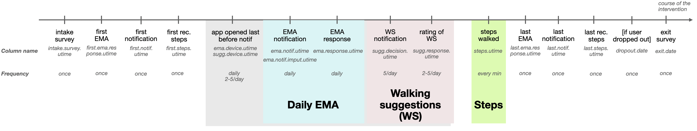

# The HeartSteps Data

## Sources
**Creators**: Shawna Smith, Susan Murphy, Pedrag Klasnja, Nick Seewald  
**Latest version by**: Lisa Gotzian

from a mobile health intervention with the HeartSteps app

based on "analysis.RData" retrieved from:
https://app.box.com/folder/4346807882

initial documentation of "analysis.RData":
https://github.com/StatisticalReinforcementLearningLab/HeartstepsV1Code/wiki/C-Analysis-data-frames

documentation of the data cleaning process:
https://github.com/StatisticalReinforcementLearningLab/HeartstepsV1Code

## Past usage
* **Reinforcement Learning & Contextual Bandits**  
  Liao, P., Greenewald, K., Klasnja, P., & Murphy, S. (2020). Personalized HeartSteps: A Reinforcement Learning Algorithm for Optimizing Physical Activity. Proceedings of the ACM on Interactive, Mobile, Wearable and Ubiquitous Technologies, 4(1), 1–22. https://doi.org/10.1145/3381007

  Greenewald K, Tewari A, Klasnja P, Murphy S. Action Centered Contextual Bandits. Advances in Neural Information Processing Systems. 2017 Dec;30:5973-5981.

* **Development of MRTs**  
  Klasnja, P., Smith, S., Seewald, N. J., Lee, A., Hall, K., Luers, B., Hekler, E. B., & Murphy, S. A. (2019). Efficacy of Contextually Tailored Suggestions for Physical Activity: A Micro-randomized Optimization Trial of HeartSteps. Annals of Behavioral Medicine, 53(6), 573–582. https://doi.org/10.1093/abm/kay067

* **mHealth Data Collection Considerations**  
  Seewald, N.J., Smith, S.N., Lee, A.J. et al. Practical Considerations for Data Collection and Management in Mobile Health Micro-randomized Trials. Stat Biosci 11, 355–370 (2019). https://doi.org/10.1007/s12561-018-09228-w

* **Development of MRTs and sample size calculator**  
  Liao, P., Klasnja, P., Tewari, A., and Murphy, S. A. (2016) Sample size calculations for micro‐randomized trials in mHealth. Statist. Med., 35: 1944– 1971. doi: 10.1002sim.6847.


## About the dataset
(a) HeartSteps is an mHealth intervention that encourages regular walking via activity suggestions tailored to the individuals’ current context.  
(b) 6-week MRT with 37 participants, notifications sent 2-5 times/day  
(c) includes the following dataframes:
* [`users.csv`](https://github.com/LisaGotzian/HeartSteps/wiki/1.-users.csv), a 37x119 dataframe for each user,  
  **identifier**: *user.index*
* [`dailyema.csv`](https://github.com/LisaGotzian/HeartSteps/wiki/2.-dailyema.csv), a 1686x180 dataframe for each user for each day,  
  **identifier**: *user.index* and *study.date*
* [`suggestions.csv`](https://github.com/LisaGotzian/HeartSteps/wiki/3.-suggestions.csv), a 8274x54 dataframe for each user for each notification,  
  **identifier**: *user.index*, *study.date* and *decision*
* [`steps.csv`](https://github.com/LisaGotzian/HeartSteps/wiki/4.-steps.csv), a 196,755x40 dataframe for each user for each minute,  
  **identifier**: *user.index*, *study.date*, *decision* and *step.time*


## The tables
There are four tables...
There is different events that are recorded within the data:


### [Users](https://github.com/LisaGotzian/HeartSteps/wiki/1.-users.csv)
[`users.csv`](https://github.com/LisaGotzian/HeartSteps/wiki/1.-users.csv) is a 37x119 data frame that contains demographic information on the participants as well as the results of the intake and exit surveys. Participants were interviewed before the study and after completing it. The exit survey re-administers the activity choice index, self-efficacy for physical activity and the IPAQ. The surveys collected data on the following topics:
* Demographic data
* Mobile phone use
* Walking environment at work
* Conscientiousness
* Activity Choice Index (intake and exit)
* Self-Efficacy for Physical Activity (intake and exit)
* International Prevalence Study (IPS) on Physical Activity
* International Physical Activity Questionnaire (IPAQ)(intake and exit)
* **Identifier**: *user.index*


### [Daily EMA](https://github.com/LisaGotzian/HeartSteps/wiki/2.-dailyema.csv)
Every night, participants responded to an ecological momentary assessment (EMA) about their day. Their responses to the questions are recoreded in [`dailyema.csv`](https://github.com/LisaGotzian/HeartSteps/wiki/2.-dailyema.csv), a 1686x xx data frame. The EMA collected data on the following topics:
* xx
* xx

### [Suggestions](https://github.com/LisaGotzian/HeartSteps/wiki/3.-suggestions.csv)

### [Steps](https://github.com/LisaGotzian/HeartSteps/wiki/4.-steps.csv)


## Data Issues

# Usage
## Preliminaries for working with time in R

```
## largest number of digits used to represent fractional seconds
options(digits.secs = 6)

## number of digits in Unix time (seconds since 1970-01-01 00:00 UTC)
## + largest number of digits used to represent fractional seconds
options(digits = 10 + 6)

sys.var <- switch(Sys.info()["sysname"],
                  "Windows" = list(locale = "English",
                                   mbox = "Z:/HeartSteps/"),
                  "Darwin" = list(locale = "en_US",
                                  mbox = "/Volumes/dav/HeartSteps/"),
                  "Linux" = list(locale = "en_US.UTF-8",
                                 mbox = "~/mbox/HeartSteps/"))
## time zone identifiers are localized, so set the locale
Sys.setlocale("LC_ALL", sys.var$locale)

## arithmetic on POSIXct objects uses system time zone, so set this to UTC
Sys.setenv(TZ = "GMT")
```

## Examplary analysis of the data
